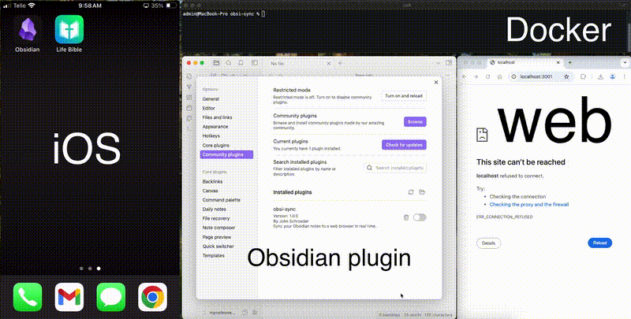

# obsi-sync

**Obsi-Sync** is a plugin for Obsidian that synchronizes your notes in real-time to a browser-based interface. It integrates with a backend server powered by Docker containers to handle note updates, and image uploads. 

---

## Demo



---

## Features
- **Real-time Sync**: Synchronizes your Obsidian notes instantly.
- **Image Support**: Automatically uploads images using Obsidian embed syntax `![[image.png]]`.
- **Browser UI**: View and manage notes through a browser interface.
- **Simple Setup**: Uses Docker for easy backend and frontend deployment.

---

## Table of Contents
1. [Requirements](#requirements)
2. [Installation](#installation)
3. [Setup Docker Containers](#setup-docker-containers)
4. [Install the Plugin in Obsidian](#install-the-plugin-in-obsidian)
5. [Usage](#usage)
6. [Troubleshooting](#troubleshooting)
7. [Contributing](#contributing)
8. [License](#license)

---

## Requirements
- **[Docker](https://www.docker.com/)** and **[Docker Compose](https://docs.docker.com/compose/)** installed.
- Obsidian v1.0 or higher.
- Basic knowledge of running Docker containers.

---

## Installation

Follow these steps to set up **Obsi-Sync**:

### 1. Clone the Repository

Clone the repository to your local machine:

```bash
git clone https://github.com/js8240168/obsi-sync.git
cd obsi-sync
```

---

## Setup Docker Containers

1. **Ensure Docker is Running**:
   Verify Docker is installed and running on your system.

2. **Start Docker Containers**:
   Run the following command to start the backend, frontend, and database:

   ```bash
   docker-compose up --build -d
   ```

   - The **backend server** will run on `http://localhost:3000`
   - The **frontend client** will run on `http://localhost:3001`

3. **Verify Containers**:
   Check that all containers are running:

   ```bash
   docker ps
   ```

   You should see the `backend`, `frontend`, and `mongodb` containers.

---

## Install the Plugin in Obsidian

1. **Locate Your Obsidian Vault**:
   Open your Obsidian vault directory. You can find this in **Settings > Vault Location**.

2. **Create a `plugins` Folder**:
   If it doesn’t already exist, create the following directory:

   ```bash
   mkdir -p /path/to/your/vault/.obsidian/plugins
   ```

3. **Copy the Plugin Files**:
   Copy the `obsi-sync` plugin folder into the `plugins` directory:

   ```bash
   cp -r obsi-sync-plugin /path/to/your/vault/.obsidian/plugins/obsi-sync
   ```

4. **Enable the Plugin**:
   - Open Obsidian.
   - Go to **Settings > Community Plugins**.
   - Enable the **obsi-sync** plugin.

---

## Usage

### Start Using the Plugin
1. Ensure Docker containers are up and running (`docker-compose up -d`).
2. Open Obsidian and start creating or editing notes.
3. Open your browser and navigate to `http://localhost:3001`.
4. Your notes will automatically sync and display in real-time.

### Adding Images
To include images in your notes, use the Obsidian embed syntax:

```markdown
![[image.png]]
```

The plugin will automatically upload the image to the backend and display it in the browser.

---

## Troubleshooting

### Backend Not Reachable
- Verify containers are running:
  ```bash
  docker ps
  ```
- Restart containers:
  ```bash
  docker-compose restart
  ```

### Notes Not Syncing
- Ensure the backend health by navigating to:
  ```bash
  http://localhost:3000/health
  ```
  The response should be:
  ```json
  { "status": "OK" }
  ```

### Plugin Not Working
- Confirm the plugin folder is correctly copied to `.obsidian/plugins/obsi-sync`.
- Reload Obsidian and re-enable the plugin.

---

## Contributing

Contributions are welcome! Follow these steps:

1. Fork this repository.
2. Create a new branch:
   ```bash
   git checkout -b feature/your-feature-name
   ```
3. Make your changes and commit:
   ```bash
   git commit -m "Add your feature description"
   ```
4. Push the branch:
   ```bash
   git push origin feature/your-feature-name
   ```
5. Open a Pull Request.

---

## License

This project is licensed under the **MIT License**.

---

## Acknowledgments
Thanks for using **obsi-sync**! Feel free to reach out for support or ideas for improvement.
